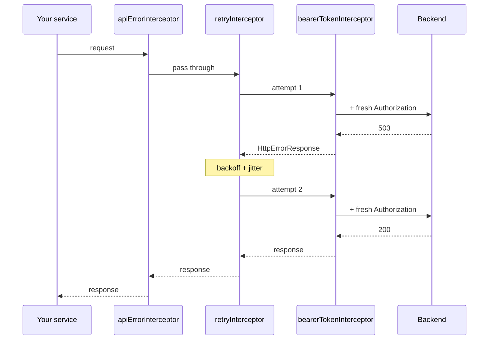

# Interceptors

The three interceptors are plain `HttpInterceptorFn`s. They are **not**
registered by `provideApi()` — you register the ones you want, in the order you
want, through `withInterceptors()`.

```ts
provideHttpClient(
  withInterceptors([
    apiErrorInterceptor, // outermost
    apiSuccessInterceptor,
    retryInterceptor,
    bearerTokenInterceptor, // yours, innermost
  ]),
);
```

They are independent: omit any of them and the rest keep working. The order,
however, is not free — see [Ordering rules](#ordering-rules).

## `retryInterceptor`

Retries failed requests with exponential backoff and jitter.

```ts
const retryInterceptor: HttpInterceptorFn;
```

**Skips the request when**

- `API_RETRY_CONFIG` is `null` (`retry: false` in `provideApi()`)
- `SKIP_RETRY` is set in the request context (`retry: false` per request)
- the method is `POST` and the request did not opt in

**Otherwise retries when** the failure is an `HttpErrorResponse` whose status is
in `retryableStatuses` (default `408, 429, 500, 502, 503, 504`).

**Delay** is `initialDelay * multiplier^(attempt-1)` plus 0–30% jitter. A
`Retry-After` response header — in seconds or as an HTTP date — overrides the
computed delay.

**Per-request config** (`ApiRequestOptions.retry`) is merged over the built-in
defaults, not over the global configuration.

Register it **after** `apiErrorInterceptor`, so that it is nested inside it and
still receives raw `HttpErrorResponse`s. See [Retry](../guides/retry.mdx).

## `apiErrorInterceptor`

Normalises every `HttpErrorResponse` into an [`ApiError`](./models.mdx#apierror),
passes it to the injected [`ApiErrorHandler`](./handlers.mdx), and rethrows it so
subscribers can still react.

```ts
const apiErrorInterceptor: HttpInterceptorFn;
```

**Normalisation**

| Response                   | `ApiError`                                                                                                                                    |
| -------------------------- | --------------------------------------------------------------------------------------------------------------------------------------------- |
| `problem+json` object body | Fields mapped through; `type` defaults to `'about:blank'`; `status` falls back to the HTTP status; missing `detail` becomes a generic message |
| Other or empty body        | `title: 'Unexpected Error'`, HTTP status preserved, body text used as `detail` when present                                                   |
| Status `0`                 | `title: 'Network Error'`, `code: 'NETWORK_ERROR'`, generic connection message                                                                 |

`timestamp` is always stamped client-side. `traceId` comes from the body, else
from the `X-Trace-Id` response header.

**Skipping the handler** — when `SKIP_ERROR_HANDLER` is set in the context
(`skipErrorHandler: true` per request), the error is still normalised and
rethrown, but the global handler is not invoked.

See [Error handling](../guides/error-handling.mdx).

## `apiSuccessInterceptor`

Resolves a success message for successful responses and passes it to the
injected [`ApiSuccessHandler`](./handlers.mdx). Only `HttpResponse` events are
considered, so upload and download progress events are ignored.

```ts
const apiSuccessInterceptor: HttpInterceptorFn;
```

**Resolution**, from `ApiRequestOptions.successMessage`:

| Value       | Result                                                                                                        |
| ----------- | ------------------------------------------------------------------------------------------------------------- |
| `string`    | That message                                                                                                  |
| `false`     | Nothing                                                                                                       |
| `true`      | The method's configured default, or the generic fallback if it has none                                       |
| _(omitted)_ | The method's default, but only for POST/PUT/PATCH/DELETE and only when `defaultShowSuccessMessage` is enabled |

See [Success messages](../guides/success-messages.mdx).

## Ordering rules

**The first interceptor in the array is the outermost one.** Everything
registered after it is nested inside, and the retry loop re-runs only what is
nested within `retryInterceptor`:



Both nestings matter. `bearerTokenInterceptor` sits inside the retry loop, so
attempt 2 is signed again rather than replaying attempt 1's token. And
`apiErrorInterceptor` sits outside it, so it never saw the 503 that the retry
fixed — and, critically, `retryInterceptor` still received a real
`HttpErrorResponse` to match against.

| Rule                                            | Why                                                                                        |
| ----------------------------------------------- | ------------------------------------------------------------------------------------------ |
| `apiErrorInterceptor` before `retryInterceptor` | Retry only matches `HttpErrorResponse`; nested the other way, **retry never fires at all** |
| `apiErrorInterceptor` outermost                 | The error handler fires once per failed operation, not once per attempt                    |
| Auth interceptor after `retryInterceptor`       | Each retried attempt is re-signed with a fresh token                                       |
