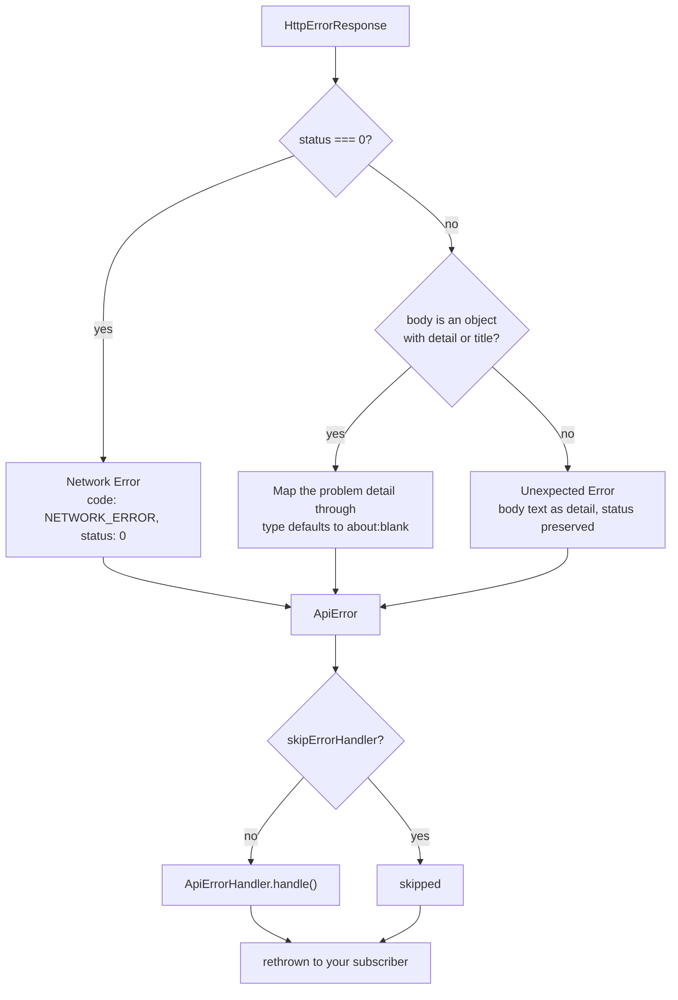

# Error handling

Every failure — an RFC 9457 `problem+json` body, a plain-text proxy error page,
or a network drop that never reached the server — arrives at your code as the
same `ApiError`.

```ts
interface ApiError {
  type: string; // RFC 9457 problem type URI, else 'about:blank'
  title?: string; // 'Bad Request'
  status: number; // 0 for a network failure
  detail: string; // safe to show the user
  instance?: string; // path that produced it
  code?: ApiErrorCode; // machine-readable, e.g. 'VALIDATION_ERROR'
  timestamp: string; // ISO 8601, stamped client-side
  traceId?: string; // from the body, else the X-Trace-Id header
  errors?: { field: string; message: string }[];
}
```

:::tip[Branch on `code`, never on `detail`]
`detail` is human-readable prose, frequently localised server-side from
`Accept-Language`. `code` is the stable contract.
:::

## How a response becomes an `ApiError`



`apiErrorInterceptor` handles three cases:

| Response                        | Result                                                                                                   |
| ------------------------------- | -------------------------------------------------------------------------------------------------------- |
| `problem+json` body             | Fields mapped through; `type` defaults to `'about:blank'`, `status` falls back to the HTTP status        |
| Plain text or unrecognised body | `title: 'Unexpected Error'`, the body text used as `detail` when there is one, HTTP status preserved     |
| Network failure (status `0`)    | `title: 'Network Error'`, `code: 'NETWORK_ERROR'`, `status: 0`, a generic connection message as `detail` |

Two details worth knowing:

- **`timestamp` is stamped client-side.** The interceptor records when your app
  saw the failure rather than trusting a value from the body.
- **`traceId` prefers the body**, then falls back to the `X-Trace-Id` response
  header. Log it — it's what correlates with your backend's logs.

A body counts as a problem detail when it is an object carrying `detail` or
`title`, so partial implementations still map cleanly.

## The `isApiError` guard

```ts
import { isApiError } from '@ismailza/ngx-api-client';

catchError((err: unknown) => {
  if (isApiError(err)) {
    console.warn(err.code, err.traceId);
  }
  return EMPTY;
});
```

Useful in a global `ErrorHandler`, or anywhere a value's origin is unknown.

## Known error codes

`ApiErrorCode` documents the codes apps commonly branch on, while staying open
to any string your backend introduces:

| Code                     | Typical meaning                        |
| ------------------------ | -------------------------------------- |
| `VALIDATION_ERROR`       | Field-level validation failed          |
| `ENTITY_NOT_FOUND`       | The requested resource does not exist  |
| `ACCESS_DENIED`          | Authenticated but not permitted        |
| `EXPIRED_TOKEN`          | Credentials need refreshing            |
| `EXTERNAL_SERVICE_ERROR` | An upstream dependency failed          |
| `INTERNAL_ERROR`         | Unhandled server-side failure          |
| `NETWORK_ERROR`          | Set by the interceptor on a status `0` |

## Validation errors

When `code === 'VALIDATION_ERROR'`, `errors` carries the field-level detail —
ideal for pushing straight into a reactive form:

```ts
private applyFieldErrors(error: ApiError): void {
  for (const { field, message } of error.errors ?? []) {
    this.form.get(field)?.setErrors({ server: message });
  }
}
```

## Presenting errors

The library renders nothing. `provideApi()` registers `DefaultApiErrorHandler`,
which forwards the error to Angular's `ErrorHandler` and stops there. To show
something, provide your own:

```ts
@Injectable()
export class ToastApiErrorHandler extends ApiErrorHandler {
  private readonly toast = inject(MyToastService);
  private readonly router = inject(Router);

  override handle(error: ApiError): void {
    if (error.status === 403) {
      this.router.navigate(['/forbidden']);
      return;
    }

    if (error.code === 'EXPIRED_TOKEN') {
      this.router.navigate(['/login']);
      return;
    }

    this.toast.error(error.detail, { title: error.title });
  }
}
```

```ts title="src/app/app.config.ts"
providers: [
  provideApi({ baseUrl: 'https://api.example.com' }),
  { provide: ApiErrorHandler, useClass: ToastApiErrorHandler },
  provideHttpClient(withInterceptors([apiErrorInterceptor, retryInterceptor])),
];
```

:::warning[The default handler logs the whole error]
`DefaultApiErrorHandler` hands the entire `ApiError` to Angular's `ErrorHandler`,
which logs it. If your API puts sensitive data in `detail` or `instance`,
register your own handler rather than relying on the fallback.
:::

## Handling an error locally instead

The global handler runs for every failed request unless the request opts out:

```ts
this.api.post<Order>('/orders', draft, { skipErrorHandler: true }).subscribe({
  error: (err: ApiError) => this.formError.set(err.detail),
});
```

`skipErrorHandler` suppresses only the global handler — the `ApiError` is still
thrown, so subscribers always get their chance to react. It's the right choice
when a form renders its own errors and a global toast would be duplication.

## Errors and retry

Register `apiErrorInterceptor` **before** `retryInterceptor`, so the error
interceptor is the outer one. It then sees only failures that survived every
retry attempt, and your handler fires once per failed operation instead of once
per attempt.

The order is not just a nicety: `apiErrorInterceptor` replaces the
`HttpErrorResponse` with a plain `ApiError`, and `retryInterceptor` only retries
`HttpErrorResponse`s. Nest them the other way round and **retry stops happening
at all**. See [Retry](./retry.mdx#ordering).
