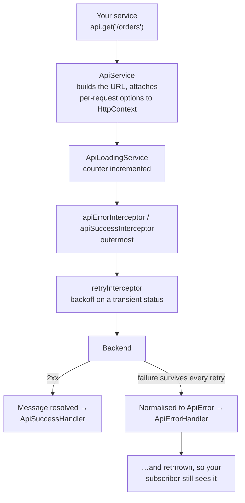

# Introduction

`HttpClient` gives you a request. It doesn't give you a _policy_ — where the base
URL comes from, how a failed response becomes something your components can
render, which requests are safe to retry, or how a loading indicator knows
anything is in flight.

Most Angular apps end up re-solving all four in an ad-hoc `ApiService` that grows
one special case at a time. **ngx-api-client is that service, extracted and made
configurable.**

```ts
// This is the whole of a typical data service.
@Injectable({ providedIn: 'root' })
export class OrderService {
  private readonly api = inject(ApiService);

  list(page: number, size: number): Observable<PaginatedResponse<Order>> {
    return this.api.getPage<Order>('/orders', page, size);
  }
}
```

`GET /orders` resolves to `https://api.example.com/api/v1/orders?page=0&size=20`,
retries on a 503, normalises a failure into one `ApiError` shape, and toggles a
loading signal on the way — all from configuration you wrote once.

## The path of one request



Everything above the handlers is the library's job. The two handlers at the
bottom are the seam where your application decides what a failure or a success
looks like.

## What it does

| Concern              | What the library provides                                                                         |
| -------------------- | ------------------------------------------------------------------------------------------------- |
| **URL building**     | `baseUrl` + optional prefix segment + optional version segment + endpoint                         |
| **Versioning**       | URL segment, query parameter, header or media type — or off; overridable per request              |
| **Errors**           | Every failure normalised into one [`ApiError`](./guides/error-handling.mdx) shape (RFC 9457)      |
| **Retry**            | Exponential backoff with jitter, `Retry-After` support, skips non-idempotent methods              |
| **Per-request opts** | Carried to interceptors through `HttpContext`, not globals                                        |
| **Presentation**     | Pluggable — the library renders nothing; you decide what an error or a success message looks like |
| **Loading state**    | A signal that counts in-flight requests                                                           |

## What it deliberately does not do

- **It renders nothing.** No toasts, no dialogs, no redirects. `provideApi()`
  registers presentation-free fallbacks and expects you to supply an adapter for
  your own UI kit. See [Error handling](./guides/error-handling.mdx).
- **It brings no UI dependency.** The peer dependencies are `@angular/core`,
  `@angular/common` and `rxjs`. That is the entire list.
- **It carries no i18n dependency.** Success messages are plain strings you pass
  in already translated.
- **It does not register interceptors for you.** Order matters, and only you know
  what else is in your chain — so you wire them up in `withInterceptors()`
  yourself.

## Design principles

**Configuration over convention, defaults over configuration.** Every option has
a default that suits a conventional REST API. Every default can be replaced, and
every global can be overridden for a single request.

**Per-request options travel with the request.** Options are attached to the
request's `HttpContext`, so an interceptor reads what _this_ call asked for
rather than consulting mutable shared state — which keeps concurrent requests
from interfering with each other.

**One error shape.** A `problem+json` body, a plain-text proxy error page and a
network drop that never reached the server all arrive at your code as the same
`ApiError`. Components branch on `code`, never on prose.

## Compatibility

Supports **Angular 17 through 22**. Every one of those majors is verified on
each push against the packed tarball — type-checked, built into a real consumer
application, and run — on both Node 22 and 24. The upper bound is deliberate: a
new major is added only once it has been validated.

See [Installation](./getting-started/installation.mdx#requirements) for the full
requirements.

## Next steps

- [Installation](./getting-started/installation.mdx) — add the package and wire up the providers
- [Quick start](./getting-started/quick-start.mdx) — a working service in five minutes
- [Configuration](./guides/configuration.mdx) — every `provideApi()` option
